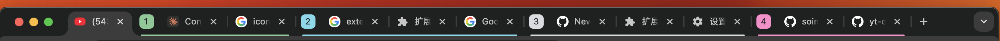

# Tab Merger / 标签页合并工具

A simple Chrome extension that merges all windows and tabs from the current Profile into a single window, automatically creating tab groups.

一个简单的 Chrome 扩展，可以将当前 Profile 下的所有窗口和标签页合并到一个窗口，并自动创建标签页分组。



---

## Features / 功能特点

- **One-Click Merge / 一键合并**: Click the extension icon to immediately merge all window tabs into the current window / 点击扩展图标，立即将所有窗口的标签页合并到当前窗口
- **Smart Sorting / 智能排序**: Tabs are arranged by window activation order (oldest first, newest last) / 标签页按窗口激活顺序排列（最早激活的窗口在前，最新激活的在后）
- **Auto Grouping / 自动分组**: Tabs from each window automatically form a group with numeric titles (1, 2, 3...) / 每个窗口的标签页自动形成一个分组，分组标题为数字（1、2、3...）
- **Random Colors / 随机颜色**: Each group is automatically assigned a random color for easy distinction / 每个分组自动分配随机颜色，方便区分
- **Multi-Profile Support / 多 Profile 支持**: Each Chrome Profile works independently / 每个 Chrome Profile 独立工作，互不干扰

---

## Installation / 安装方法

1. Download or clone this project locally / 下载或克隆此项目到本地
2. Open Chrome browser and visit `chrome://extensions/` / 打开 Chrome 浏览器，访问 `chrome://extensions/`
3. Enable "Developer mode" in the top right corner / 开启右上角的"开发者模式"
4. Click "Load unpacked" / 点击"加载已解压的扩展程序"
5. Select the project directory `chrome-extension` / 选择项目目录 `chrome-extension`

---

## Usage / 使用方法

1. Open multiple Chrome windows / 打开多个 Chrome 窗口
2. Click the **Tab Merger** extension icon in the toolbar of any window / 在任意窗口的工具栏中点击 **Tab Merger** 扩展图标
3. All tabs from all windows will be automatically merged into the current window / 所有窗口的标签页将自动合并到当前窗口
4. Tabs from each window will form a colored group / 每个窗口的标签页会形成一个带颜色的分组

---

## Example / 效果示例

Assume you have 3 windows with activation order: Window A → Window B → Window C

假设您有 3 个窗口，按激活顺序为：窗口 A → 窗口 B → 窗口 C

After clicking the extension in Window C / 在窗口 C 中点击扩展后：
- Window C's tabs remain at the front (ungrouped) / 窗口 C 的标签页保持在前面（未分组）
- All tabs from Window A → Group "1" (random color, e.g., blue) / 窗口 A 的所有标签页 → 分组 "1"（随机颜色，如蓝色）
- All tabs from Window B → Group "2" (random color, e.g., red) / 窗口 B 的所有标签页 → 分组 "2"（随机颜色，如红色）
- Window A and Window B close automatically / 窗口 A 和窗口 B 自动关闭


---

## Project Structure / 项目结构

```
chrome-extension/
├── manifest.json       # Extension config / 扩展配置文件
├── background.js      # Background service script (core logic) / 后台服务脚本（核心逻辑）
├── icons/             # Extension icons / 扩展图标
│   ├── icon16.png
│   ├── icon48.png
│   └── icon128.png
└── README.md          # Project documentation / 项目说明
```

---

## Permissions / 权限说明

This extension requires the following permissions / 本扩展需要以下权限：
- `tabs` - Access and move tabs / 访问和移动标签页
- `windows` - Access window information / 访问窗口信息
- `tabGroups` - Create and manage tab groups / 创建和管理标签页分组

---

## Tech Stack / 技术栈

- Chrome Extension Manifest V3
- Chrome Tabs API
- Chrome Windows API
- Chrome Tab Groups API

---

## Development / 开发

To modify the extension, edit the corresponding files and click the refresh button on the `chrome://extensions/` page.

如需修改扩展，编辑相应文件后在 `chrome://extensions/` 页面点击刷新按钮即可。

---

## License

[MIT](LICENSE)
